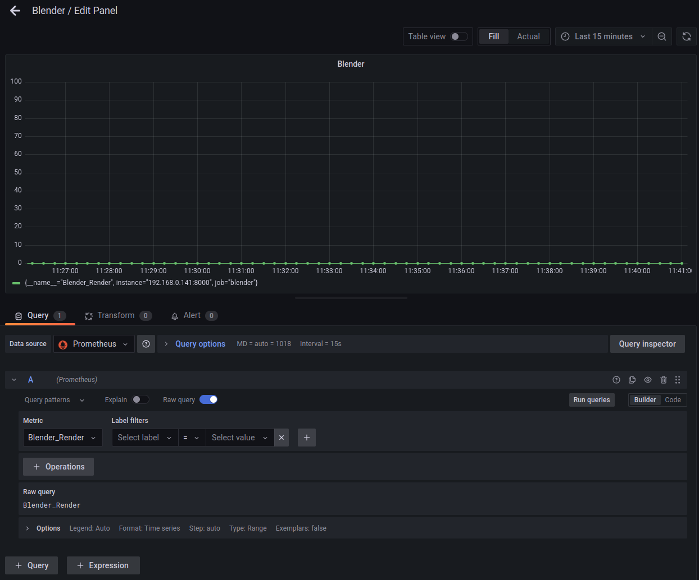
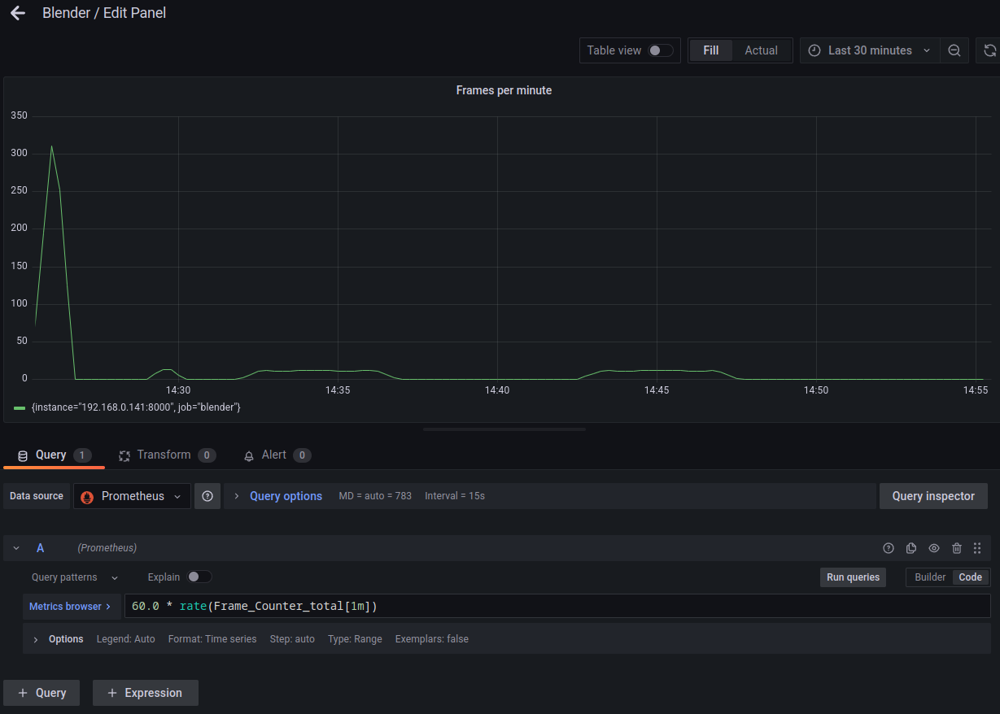

- [A Prometheus add-on for Blender](#a-prometheus-add-on-for-blender)
  - [Donations accepted](#donations-accepted)
  - [Installing the add-on](#installing-the-add-on)
  - [Configuring Prometheus](#configuring-prometheus)
  - [Configuring Grafana](#configuring-grafana)
  - [Building the add-on](#building-the-add-on)
  - [Source code](#source-code)

# A Prometheus add-on for Blender

Exposes [Prometheus](https://prometheus.io/) metrics on port 8000 when enabled.

In particular, it exposes a [Gauge](https://prometheus.io/docs/concepts/metric_types/#gauge), *Blender_Render*, that is 1 when the Blender instance is rendering, and 0 when it is not,
and a [Counter](https://prometheus.io/docs/concepts/metric_types/#counter), *Frame_Counter*, that is incremented for every successfully rendered frame. 

The standard metrics, like cpu usage are also exposed.

## Donations accepted

You are more than welcome to use this add-on: It is completely free and open source.

But if you would like to show your appreciation and you can afford it, consider following the sponsor button at the top of this repo.

## Installing the add-on

Download https://github.com/varkenvarken/blender-prometheus/blob/main/blenderprometheus.zip directly from the repository and install and enabled as usual.
You can also build the add-on yourself, see [below](#building-the-add-on)

The add-on has a single preference option 'Address:port' which can be set to a machine name (or ip-address) and port combination. When changed, the metric server will stopped and restarted to listen on this new address:port combination. If the address or port in invalid the server will start listening on all addresses and port 8000 (i.e. 0.0.0.0:8000)

Note that add-on preferences are only saved if you leave the add-on enabled.
(see https://projects.blender.org/blender/blender/issues/71486)

## Configuring Prometheus

I am running Prometheus is a [Docker container](https://hub.docker.com/r/prom/prometheus)

Configuring Prometheus is out-of-scope for this readme,
but an example prometheus.yml is shown below
(your ip-address and port maybe different of course):

```yaml
global:
  scrape_interval:     15s

scrape_configs:
  - job_name: 'blender'
    static_configs:
      - targets:
        - 192.168.0.141:8000 
```

## Configuring Grafana

I am running Grafana in a [Docker container](https://hub.docker.com/r/grafana/grafana)

Configuring Grafana is out-of-scope for this readme,
but it is extremely straight forward to add a panel (if you have Grafana configured to talk to your Prometheus server).
Screenshots of the Blender render and Frames per minute panels shown below.





## Building the add-on

We have included the [prometheus_client](https://github.com/prometheus/client_python/tree/master) for Python
as a submodule in the src directory.

This means that after cloning the repo you will need to initialize and update the submodule before you can build
the add-on yourself.

```bash

git clone https://github.com/varkenvarken/blender-prometheus.git
cd blender-prometheus
git submodule init
git submodule update
cd src
zip -ur ../blenderprometheus.zip blenderprometheus
```

Then install `prometheus.zip` in the usual way and enable the add-on.

You can inspect the published metrics on http://localhost:8000.

If you are using VScode, you can also open `blender-prometheus/__init__.py` and select `Terminal -> Run Task ... -> Zip` 
(because a tasks.json is present in the .vscode directory)

## Source code

The code is extremely simple: when the add-on is enabled we create a Gauge and a Counter metric and start the prometheus http server.

We also register a bunch of [app handlers](https://docs.blender.org/api/latest/bpy.app.handlers.html#module-bpy.app.handlers)
that updates the Gauge when a render job is started or ends, and updates the Counter for every successful frame render.

The app handlers are made persistent, so it will keep running even if we load another .blend file.

The Prometheus server is running in a separate (daemon) thread and will only end if we exit Blender or if we invoke our custom `stop_server()` function.

We needed to create custom start_server() and stop_server() functions because the Prometheus `start_http-server()` function does not return the server it creates,
so we have no way to call its `shutdown()` function (which is present, because it is a subclass of [http.server](https://docs.python.org/3.11/library/http.server.html)) or call `close()` on the socket it is listening on, and this would prevent us from disabling and then enabling the add-on again, because we would get an address in use exception.

Same goes for the Gauge and the Counter: If we want to be able to reenable the add-on we  have to make sure to remove them from the registry in the `unregister()` function.

The custom server code, which unfortunately had to duplicate a few lines from the original code in prometheus_client/exposition.py because not everything we needed was exposed publicly, is all contained in server.py

